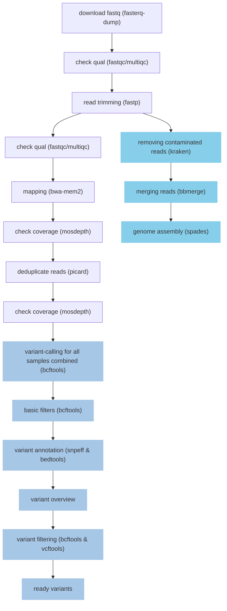

```mermaid
graph TD;
    classDef In1 fill:#A7C7E7,stroke:#A7C7E7,stroke-width:2px;
    classDef In2 fill:#87CEEB,stroke:#87CEEB,stroke-width:2px;

    A1["download fastq (fasterq-dump)"]-->A2["check qual (fastqc/multiqc)"];
    A2-->A3["read trimming (fastp)"];
    A3-->A4["check qual (fastqc/multiqc)"];
    A4-->A5["mapping (bwa-mem2)"];
    A5-->A6["check coverage (mosdepth)"];
    A6-->A7["deduplicate reads (picard)"];
    A7-->A8["check coverage (mosdepth)"];
    A8-->A9["variant-calling for all samples combined (bcftools)"]:::In1;
    A9-->A10["basic filters (bcftools)"]:::In1;
    A10-->A11["variant annotation (snpeff & bedtools)"]:::In1;
    A11-->A12["variant overview"]:::In1;
    A12-->A13["variant filtering (bcftools & vcftools)"]:::In1;
    A13-->A14["ready variants"]:::In1;
    A3-->B1["removing contaminated reads (kraken)"]:::In2;
    B1-->B2["merging reads (bbmerge)"]:::In2;
    B2-->B3["genome assembly (spades)"]:::In2;
```
